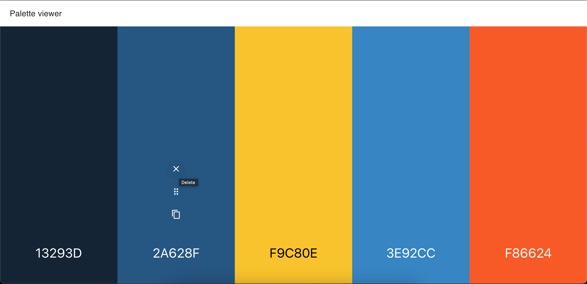

# Palette Viewer

Welcome to **Palette Viewer**! 🎨✨ [DEMO](https://mpstyle.github.io/palette-viewer/)

## What is Palette Viewer?

Palette Viewer is your ultimate tool for creating, viewing, and managing color palettes. Whether you're a designer, developer, or just someone who loves playing with colors, this app is for you! With Palette Viewer, you can easily generate random color palettes, customize them, and save your favorite combinations.

## Features

- **Random Palette Generation**: Can't decide on a color scheme? Let Palette Viewer surprise you with a random palette!
- **Drag and Drop**: Easily rearrange colors in your palette with a simple drag and drop interface.
- **Color Copying**: Copy any color's hex code to your clipboard with a single click.
- **Color Deletion**: Remove colors you don't like from your palette.
- **Add New Colors**: Insert new colors into your palette at any position.
- **Contrast Check**: Automatically get the best contrast color (black or white) for text over your chosen colors.
- **Responsive Design**: Enjoy a seamless experience on any device, whether it's a desktop, tablet, or mobile.

## Why Use Palette Viewer?

- **User-Friendly**: Intuitive and easy to use, even for beginners.
- **Customizable**: Tailor your palettes to your exact needs.
- **Efficient**: Save time by quickly generating and editing color schemes.
- **Fun**: Experiment with colors and discover new combinations you might not have thought of!

## License

Palette Viewer is licensed under the MIT License. This means you can use, copy, modify, merge, publish, distribute, sublicense, and/or sell copies of the software, as long as you include the original copyright notice and this permission notice in all copies or substantial portions of the software.

## How to Contribute

We love contributions! If you have ideas for new features, improvements, or bug fixes, here's how you can contribute:

1. **Fork the Repository**: Click the "Fork" button at the top right of this page to create a copy of the repository in your GitHub account.
2. **Clone Your Fork**: Clone your forked repository to your local machine using `git clone https://github.com/your-username/palette-viewer.git`.
3. **Create a Branch**: Create a new branch for your feature or bug fix using `git checkout -b your-branch-name`.
4. **Make Your Changes**: Implement your changes in the codebase.
5. **Commit Your Changes**: Commit your changes with a descriptive commit message using `git commit -m "Description of your changes"`.
6. **Push to Your Fork**: Push your changes to your forked repository using `git push origin your-branch-name`.
7. **Open a Pull Request**: Go to the original repository and open a pull request from your forked repository. Provide a clear description of your changes and why they should be merged.

Thank you for contributing to Palette Viewer! Together, we can make this tool even more awesome! 🚀

---

Happy coloring! 🌈